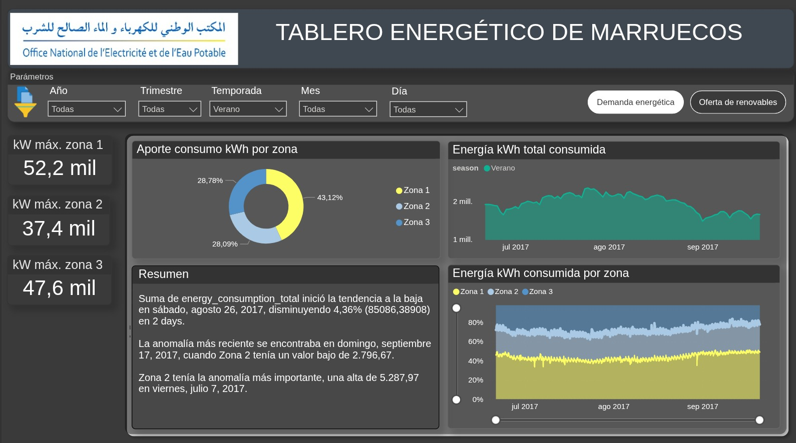
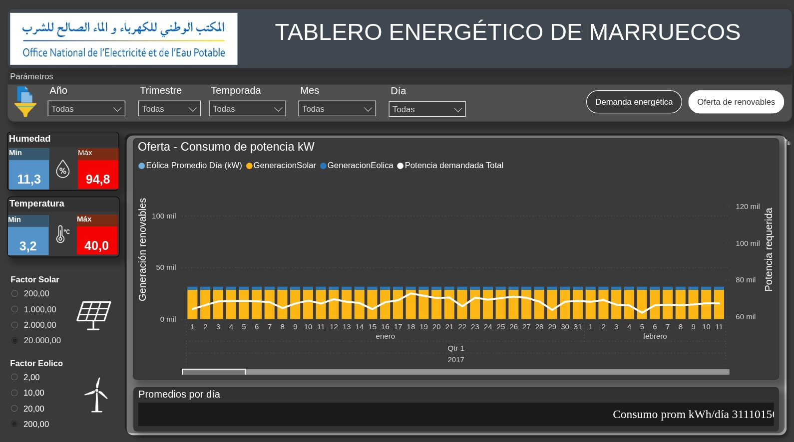
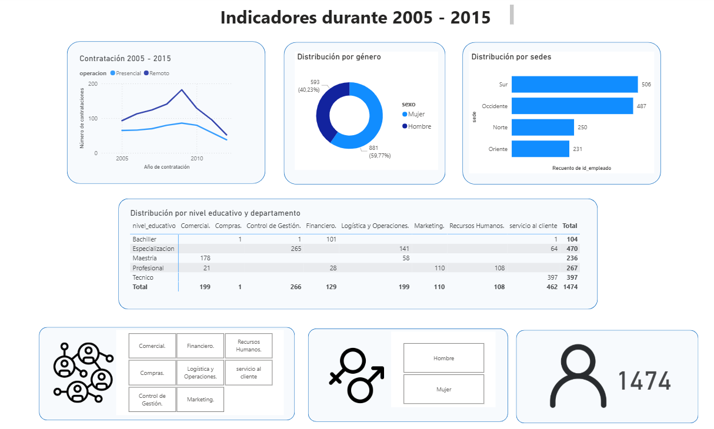
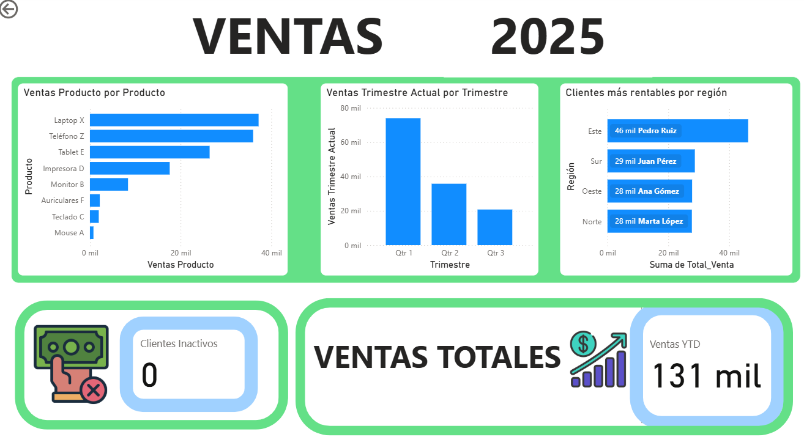
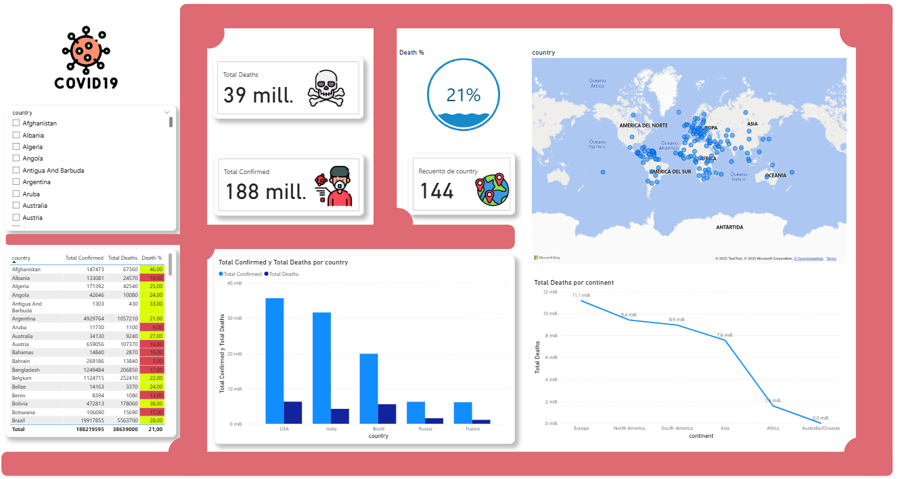
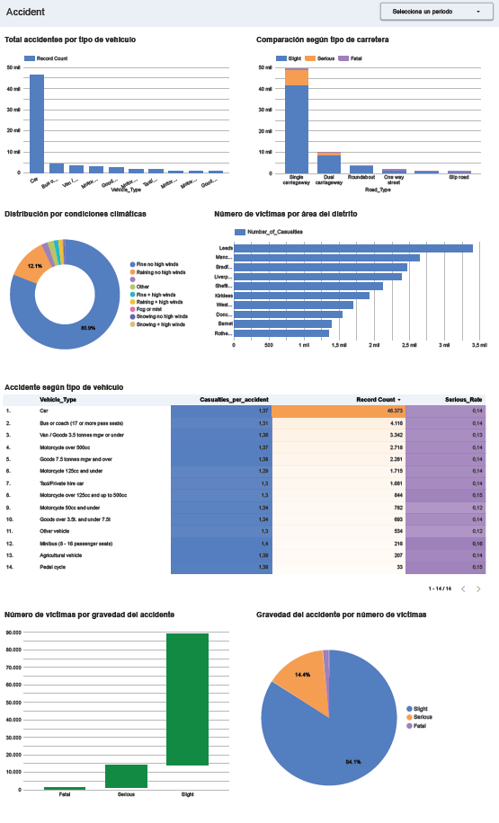

# Power Bi projects

Power BI projects and tasks involving data analysis and visualization using CSV datasets.

Project

  

  

ETL process of project is this link [ETL process](https://github.com/joaquinUAO/Proyecto_ETL_UAO)

---

Taller 1

  

Taller 2

  

Taller 3

  

Taller 4

  

### 📄 License

This project is under the License. See the `LICENSE` file for more details.

---

## 👨‍💻 Author / Autor

**Diego Ivan Perea Montealegre**

- GitHub: [@diegoperea20](https://github.com/diegoperea20)
